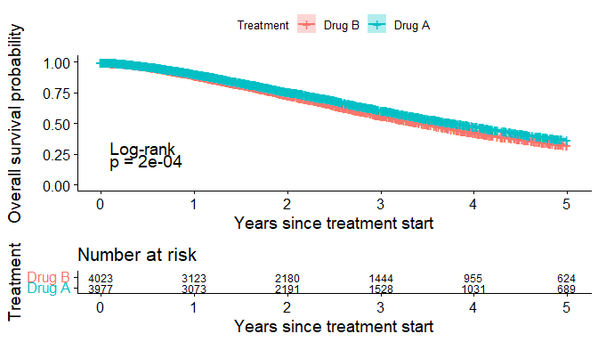
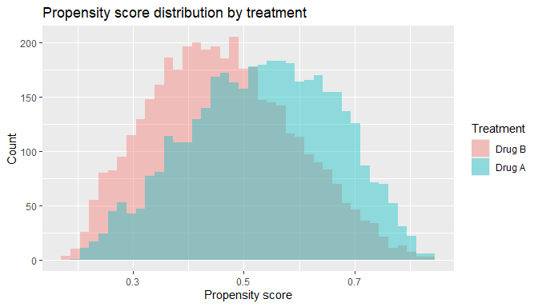
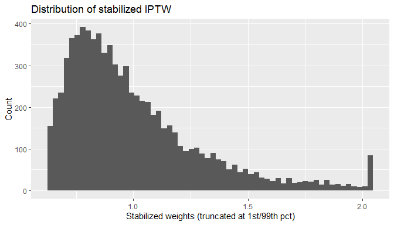
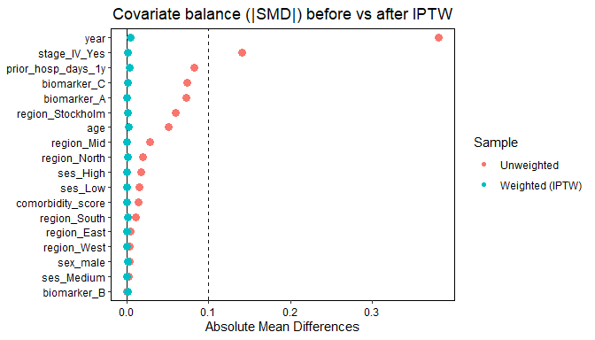
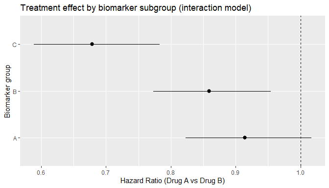

Comparative Survival Analysis of Drug A vs Drug B Using Simulated
Real‑World Data
================

- [Executive summary](#executive-summary)
- [Background and objective](#background-and-objective)
- [Data description](#data-description)
- [Methods](#methods)
  - [Overview](#overview)
- [1. Import and prepare data](#1-import-and-prepare-data)
- [2. Baseline characteristics](#2-baseline-characteristics)
- [3. Unadjusted survival
  (Kaplan–Meier)](#3-unadjusted-survival-kaplanmeier)
- [4. Adjusted Cox model (primary)](#4-adjusted-cox-model-primary)
- [5. Propensity score IPTW
  (robustness)](#5-propensity-score-iptw-robustness)
  - [5.1 Estimate propensity scores](#51-estimate-propensity-scores)
  - [5.2 Stabilized weights +
    diagnostics](#52-stabilized-weights--diagnostics)
  - [5.3 Balance assessment (before vs after
    weighting)](#53-balance-assessment-before-vs-after-weighting)
  - [5.4 Weighted Cox model](#54-weighted-cox-model)
- [6. Effect modification by
  biomarker](#6-effect-modification-by-biomarker)
- [7. Results (auto-populated when
  knitted)](#7-results-auto-populated-when-knitted)
  - [Baseline imbalance](#baseline-imbalance)
  - [Crude survival](#crude-survival)
  - [Adjusted association (primary
    Cox)](#adjusted-association-primary-cox)
  - [IPTW robustness](#iptw-robustness)
  - [Biomarker heterogeneity](#biomarker-heterogeneity)
- [8. Discussion](#8-discussion)
  - [Interpretation](#interpretation)
  - [Assumptions and limitations](#assumptions-and-limitations)

# Executive summary

This report demonstrates a **comparative effectiveness** workflow for
observational oncology research using simulated registry‑like data:

- Describe baseline differences between treatment groups (**confounding
  check**).
- Compare crude survival using Kaplan–Meier curves (**descriptive**).
- Estimate an adjusted association using a multivariable Cox model
  (**measured confounding control**).
- Re‑estimate using **propensity score inverse probability of treatment
  weighting (IPTW)** as a robustness analysis.
- Explore **effect modification** by biomarker subgroup.

# Background and objective

In real‑world oncology research, treatment allocation is not randomized.
Patients receiving different therapies often differ in age, disease
severity, comorbidity, and socioeconomic factors, which can confound
treatment–outcome associations.

**Primary objective:** estimate the association between **Drug A vs Drug
B** and **overall survival** (time to death).

**Secondary objectives:** - Assess baseline imbalances (standardized
mean differences, SMD). - Compare crude survival curves (Kaplan–Meier +
log‑rank). - Evaluate robustness using propensity score weighting
(stabilized IPTW). - Explore heterogeneity of treatment effect by
biomarker (A/B/C).

# Data description

Simulated cohort (target N ≈ 12,000 patients), intended to mimic linked
register data.

- **Exposure:** `treat_drugA` (0 = Drug B, 1 = Drug A)
- **Outcome:** `time_years` (follow‑up time in years), `event_death` (1
  = death, 0 = censored)
- **Baseline covariates (measured):**
  - Demographics: `age`, `sex_male`
  - Disease severity: `stage_IV`
  - Health status: `comorbidity_score`, `prior_hosp_days_1y`
  - Socioeconomic: `ses` (Low/Medium/High)
  - Geography / health system: `region`
  - Calendar time: `year`
  - Biology: `biomarker` (A/B/C)

# Methods

## Overview

1.  **Baseline comparison** by treatment group
    - Create a Table 1 and compute SMD (imbalance threshold: \|SMD\| \>
      0.10).
2.  **Kaplan–Meier (KM)**
    - Plot unadjusted survival curves, report 1/3/5‑year survival, and
      log‑rank p‑value.
3.  **Adjusted Cox proportional hazards model**
    - Fit: `Surv(time_years, event_death) ~ treat + covariates`
    - Report adjusted hazard ratio (HR) for Drug A vs Drug B with 95%
      CI.
    - Check proportional hazards (PH) using `cox.zph()`.
4.  **Propensity score IPTW (robustness)**
    - Estimate propensity score (PS): `P(Drug A | covariates)`
    - Compute **stabilized weights** to estimate an **ATE** (average
      treatment effect).
    - Assess post‑weighting balance (SMD + love plot).
    - Fit weighted Cox model with robust SE.
    - Optional: weight truncation at 1st/99th percentiles to reduce
      influence of extreme weights.
5.  **Effect modification**
    - Fit interaction model: `treat * biomarker` + confounders
    - Derive HR within each biomarker group via linear combinations.
    - Visualize subgroup HRs (forest plot).

------------------------------------------------------------------------

``` r
# Global chunk options for a clean report
knitr::opts_chunk$set(
  echo = TRUE,
  message = FALSE,
  warning = FALSE,
  fig.width = 7,
  fig.height = 4
)

# Load packages
required_pkgs <- c(
  "dplyr", "ggplot2",
  "survival", "survminer",
  "tableone", "broom",
  "cobalt"
)

missing_pkgs <- setdiff(required_pkgs, rownames(installed.packages()))
if (length(missing_pkgs) > 0) {
  stop("Missing packages: ", paste(missing_pkgs, collapse = ", "),
       ". Please install them, e.g. install.packages(c(",
       paste(sprintf('"%s"', missing_pkgs), collapse = ", "),
       ")).")
}

library(dplyr)
```

    ## 
    ## Attaching package: 'dplyr'

    ## The following objects are masked from 'package:stats':
    ## 
    ##     filter, lag

    ## The following objects are masked from 'package:base':
    ## 
    ##     intersect, setdiff, setequal, union

``` r
library(ggplot2)
library(survival)
library(survminer)
```

    ## Loading required package: ggpubr

    ## 
    ## Attaching package: 'survminer'

    ## The following object is masked from 'package:survival':
    ## 
    ##     myeloma

``` r
library(tableone)
library(broom)
library(cobalt)
```

    ##  cobalt (Version 4.6.2, Build Date: 2026-01-29)

# 1. Import and prepare data

``` r
data_raw <- read.csv("pharmacoepi_survival_simulated.csv", stringsAsFactors = FALSE)

# Quick peek
dplyr::glimpse(data_raw)
```

    ## Rows: 8,000
    ## Columns: 15
    ## $ id                   <int> 1, 2, 3, 4, 5, 6, 7, 8, 9, 10, 11, 12, 13, 14, 15…
    ## $ age                  <dbl> 75.5, 64.8, 71.6, 69.2, 64.6, 72.0, 85.4, 70.6, 7…
    ## $ sex_male             <int> 1, 1, 1, 1, 1, 1, 1, 1, 1, 1, 1, 1, 1, 1, 1, 1, 1…
    ## $ stage_IV             <int> 0, 0, 0, 1, 0, 1, 1, 0, 0, 1, 1, 0, 1, 0, 1, 0, 0…
    ## $ comorbidity_score    <int> 5, 1, 4, 2, 2, 2, 4, 0, 1, 0, 1, 0, 1, 2, 2, 5, 6…
    ## $ prior_hosp_days_1y   <int> 5, 0, 0, 0, 0, 0, 0, 0, 0, 16, 0, 5, 0, 5, 3, 0, …
    ## $ ses                  <chr> "Low", "Low", "Medium", "Medium", "Low", "Low", "…
    ## $ region               <chr> "East", "Stockholm", "North", "North", "South", "…
    ## $ year                 <int> 2023, 2021, 2018, 2025, 2023, 2024, 2022, 2025, 2…
    ## $ biomarker            <chr> "C", "B", "C", "A", "B", "B", "A", "C", "B", "A",…
    ## $ treat_drugA          <int> 1, 0, 1, 1, 1, 0, 1, 1, 0, 1, 1, 1, 0, 0, 1, 0, 0…
    ## $ treatment_delay_days <int> 17, 42, 33, 53, 59, 8, 13, 5, 10, 4, 5, 26, 18, 1…
    ## $ line_of_therapy      <chr> "2nd", "1st", "1st", "1st", "1st", "2nd", "1st", …
    ## $ time_years           <dbl> 0.9566, 5.0000, 4.0738, 1.2178, 2.7832, 2.9460, 3…
    ## $ event_death          <int> 1, 0, 1, 0, 0, 1, 1, 1, 1, 0, 0, 0, 0, 0, 1, 1, 1…

``` r
head(data_raw)
```

    ##   id  age sex_male stage_IV comorbidity_score prior_hosp_days_1y    ses
    ## 1  1 75.5        1        0                 5                  5    Low
    ## 2  2 64.8        1        0                 1                  0    Low
    ## 3  3 71.6        1        0                 4                  0 Medium
    ## 4  4 69.2        1        1                 2                  0 Medium
    ## 5  5 64.6        1        0                 2                  0    Low
    ## 6  6 72.0        1        1                 2                  0    Low
    ##      region year biomarker treat_drugA treatment_delay_days line_of_therapy
    ## 1      East 2023         C           1                   17             2nd
    ## 2 Stockholm 2021         B           0                   42             1st
    ## 3     North 2018         C           1                   33             1st
    ## 4     North 2025         A           1                   53             1st
    ## 5     South 2023         B           1                   59             1st
    ## 6     South 2024         B           0                    8             2nd
    ##   time_years event_death
    ## 1     0.9566           1
    ## 2     5.0000           0
    ## 3     4.0738           1
    ## 4     1.2178           0
    ## 5     2.7832           0
    ## 6     2.9460           1

``` r
# Data cleaning + type casting
# - Keep original variables, but create human-readable factors for modeling/plots
data <- data_raw %>%
  mutate(
    # treatment coding: 0/1 -> factor with labels
    treat_drugA = as.integer(treat_drugA),
    treat = factor(treat_drugA, levels = c(0, 1), labels = c("Drug B", "Drug A")),

    # outcome/event
    event_death = as.integer(event_death),

    # covariates
    age = as.numeric(age),
    sex_male = as.integer(sex_male),
    stage_IV = factor(stage_IV, levels = c(0, 1), labels = c("No", "Yes")),
    comorbidity_score = as.integer(comorbidity_score),
    prior_hosp_days_1y = as.integer(prior_hosp_days_1y),
    ses = factor(ses, levels = c("Low", "Medium", "High")),
    region = factor(region),
    year = as.integer(year),
    biomarker = factor(biomarker, levels = c("A", "B", "C"))
  )

# Missingness table (counts of NA by variable)
missing_tbl <- data %>% summarise(across(everything(), ~sum(is.na(.))))
missing_tbl
```

    ##   id age sex_male stage_IV comorbidity_score prior_hosp_days_1y ses region year
    ## 1  0   0        0        0                 0                  0   0      0    0
    ##   biomarker treat_drugA treatment_delay_days line_of_therapy time_years
    ## 1         0           0                    0               0          0
    ##   event_death treat
    ## 1           0     0

> **Analysis dataset:** For simplicity, models below use complete‑case
> rows for the variables in each model.  
> In applied work, you would consider multiple imputation or other
> missing data strategies when appropriate.

# 2. Baseline characteristics

``` r
# Variables for baseline comparison
vars <- c(
  "age", "sex_male", "stage_IV",
  "comorbidity_score", "prior_hosp_days_1y",
  "ses", "region", "year", "biomarker"
)

tab1 <- CreateTableOne(
  vars = vars,
  strata = "treat",
  data = data,
  test = FALSE
)

# Print Table 1 with standardized mean differences
print(tab1, smd = TRUE)
```

    ##                                 Stratified by treat
    ##                                  Drug B          Drug A          SMD   
    ##   n                                 4023            3977               
    ##   age (mean (SD))                  70.34 (7.96)    69.93 (7.89)   0.051
    ##   sex_male (mean (SD))              0.97 (0.17)     0.97 (0.17)   0.017
    ##   stage_IV = Yes (%)                1591 (39.5)     2134 (53.7)   0.286
    ##   comorbidity_score (mean (SD))     2.20 (1.52)     2.22 (1.43)   0.014
    ##   prior_hosp_days_1y (mean (SD))    5.68 (8.56)     5.01 (7.73)   0.082
    ##   ses (%)                                                         0.045
    ##      Low                            1237 (30.7)     1163 (29.2)        
    ##      Medium                         1821 (45.3)     1790 (45.0)        
    ##      High                            965 (24.0)     1024 (25.7)        
    ##   region (%)                                                      0.152
    ##      East                            599 (14.9)      573 (14.4)        
    ##      Mid                             695 (17.3)      576 (14.5)        
    ##      North                           541 (13.4)      456 (11.5)        
    ##      South                           594 (14.8)      543 (13.7)        
    ##      Stockholm                       937 (23.3)     1165 (29.3)        
    ##      West                            657 (16.3)      664 (16.7)        
    ##   year (mean (SD))               2021.10 (2.25)  2021.96 (2.24)   0.381
    ##   biomarker (%)                                                   0.201
    ##      A                              1759 (43.7)     1449 (36.4)        
    ##      B                              1603 (39.8)     1584 (39.8)        
    ##      C                               661 (16.4)      944 (23.7)

``` r
# Extract SMD and list the largest imbalances (absolute SMD)
smd_vec <- ExtractSmd(tab1)
smd_tbl <- tibble::tibble(
  variable = names(smd_vec),
  smd = as.numeric(smd_vec),
  abs_smd = abs(as.numeric(smd_vec))
) %>%
  arrange(desc(abs_smd))

smd_tbl %>% head(10)
```

    ## # A tibble: 9 × 2
    ##      smd abs_smd
    ##    <dbl>   <dbl>
    ## 1 0.381   0.381 
    ## 2 0.286   0.286 
    ## 3 0.201   0.201 
    ## 4 0.152   0.152 
    ## 5 0.0821  0.0821
    ## 6 0.0512  0.0512
    ## 7 0.0449  0.0449
    ## 8 0.0168  0.0168
    ## 9 0.0142  0.0142

# 3. Unadjusted survival (Kaplan–Meier)

``` r
# KM fit
df_km <- data %>%
  select(time_years, event_death, treat) %>%
  filter(complete.cases(.))

fit_km <- survfit(Surv(time_years, event_death) ~ treat, data = df_km)

# Survival at 1, 3, 5 years
km_times <- c(1, 3, 5)
km_summ <- summary(fit_km, times = km_times)

# Tidy survival estimates into a table
km_tbl <- data.frame(
  time_years = km_summ$time,
  treat = gsub("^treat=", "", km_summ$strata),
  surv = km_summ$surv,
  lower = km_summ$lower,
  upper = km_summ$upper
)

km_tbl
```

    ##   time_years  treat      surv     lower     upper
    ## 1          1 Drug B 0.8956602 0.8858440 0.9055853
    ## 2          3 Drug B 0.5661152 0.5486217 0.5841665
    ## 3          5 Drug B 0.3236709 0.3055900 0.3428217
    ## 4          1 Drug A 0.9058979 0.8964082 0.9154881
    ## 5          3 Drug A 0.6103858 0.5929600 0.6283237
    ## 6          5 Drug A 0.3667497 0.3478493 0.3866771

``` r
# Log-rank test (unadjusted)
lr <- survdiff(Surv(time_years, event_death) ~ treat, data = df_km)
logrank_p <- 1 - pchisq(lr$chisq, df = length(lr$n) - 1)

# Plot KM curves
ggsurvplot(
  fit_km,
  data = df_km,
  risk.table = TRUE,
  risk.table.height = 0.30,
  risk.table.fontsize = 3.2,
  conf.int = TRUE,
  pval = TRUE,
  pval.method = TRUE,
  pval.size = 5,
  xlab = "Years since treatment start",
  ylab = "Overall survival probability",
  legend.title = "Treatment",
  legend.labs = c("Drug B", "Drug A")
)
```

<!-- -->

# 4. Adjusted Cox model (primary)

``` r
# Primary adjusted Cox PH model
m1 <- coxph(
  Surv(time_years, event_death) ~
    treat + age + sex_male + stage_IV +
    comorbidity_score + prior_hosp_days_1y +
    ses + region + year + biomarker,
  data = data
)

summary(m1)
```

    ## Call:
    ## coxph(formula = Surv(time_years, event_death) ~ treat + age + 
    ##     sex_male + stage_IV + comorbidity_score + prior_hosp_days_1y + 
    ##     ses + region + year + biomarker, data = data)
    ## 
    ##   n= 8000, number of events= 3648 
    ## 
    ##                         coef exp(coef)  se(coef)      z Pr(>|z|)    
    ## treatDrug A        -0.177702  0.837192  0.034593 -5.137 2.79e-07 ***
    ## age                 0.033691  1.034265  0.002129 15.825  < 2e-16 ***
    ## sex_male            0.087235  1.091153  0.105287  0.829 0.407363    
    ## stage_IVYes         0.506236  1.659034  0.033740 15.004  < 2e-16 ***
    ## comorbidity_score   0.115536  1.122474  0.010925 10.575  < 2e-16 ***
    ## prior_hosp_days_1y  0.015249  1.015366  0.001884  8.093 5.84e-16 ***
    ## sesMedium          -0.184876  0.831207  0.038311 -4.826 1.40e-06 ***
    ## sesHigh            -0.263404  0.768431  0.044951 -5.860 4.64e-09 ***
    ## regionMid          -0.046309  0.954747  0.058483 -0.792 0.428456    
    ## regionNorth        -0.011804  0.988265  0.062256 -0.190 0.849618    
    ## regionSouth        -0.110350  0.895520  0.061275 -1.801 0.071718 .  
    ## regionStockholm    -0.076946  0.925940  0.053106 -1.449 0.147362    
    ## regionWest         -0.099203  0.905559  0.058165 -1.706 0.088094 .  
    ## year               -0.003673  0.996334  0.007454 -0.493 0.622180    
    ## biomarkerB          0.044302  1.045298  0.037504  1.181 0.237503    
    ## biomarkerC          0.171521  1.187109  0.044927  3.818 0.000135 ***
    ## ---
    ## Signif. codes:  0 '***' 0.001 '**' 0.01 '*' 0.05 '.' 0.1 ' ' 1
    ## 
    ##                    exp(coef) exp(-coef) lower .95 upper .95
    ## treatDrug A           0.8372     1.1945    0.7823    0.8959
    ## age                   1.0343     0.9669    1.0300    1.0386
    ## sex_male              1.0912     0.9165    0.8877    1.3412
    ## stage_IVYes           1.6590     0.6028    1.5529    1.7725
    ## comorbidity_score     1.1225     0.8909    1.0987    1.1468
    ## prior_hosp_days_1y    1.0154     0.9849    1.0116    1.0191
    ## sesMedium             0.8312     1.2031    0.7711    0.8960
    ## sesHigh               0.7684     1.3014    0.7036    0.8392
    ## regionMid             0.9547     1.0474    0.8513    1.0707
    ## regionNorth           0.9883     1.0119    0.8747    1.1165
    ## regionSouth           0.8955     1.1167    0.7942    1.0098
    ## regionStockholm       0.9259     1.0800    0.8344    1.0275
    ## regionWest            0.9056     1.1043    0.8080    1.0149
    ## year                  0.9963     1.0037    0.9819    1.0110
    ## biomarkerB            1.0453     0.9567    0.9712    1.1250
    ## biomarkerC            1.1871     0.8424    1.0870    1.2964
    ## 
    ## Concordance= 0.621  (se = 0.005 )
    ## Likelihood ratio test= 703.7  on 16 df,   p=<2e-16
    ## Wald test            = 711.4  on 16 df,   p=<2e-16
    ## Score (logrank) test = 716.7  on 16 df,   p=<2e-16

``` r
# Tidy HR table (exponentiated coefficients)
cox_table <- tidy(m1, exponentiate = TRUE, conf.int = TRUE)
cox_table
```

    ## # A tibble: 16 × 7
    ##    term               estimate std.error statistic  p.value conf.low conf.high
    ##    <chr>                 <dbl>     <dbl>     <dbl>    <dbl>    <dbl>     <dbl>
    ##  1 treatDrug A           0.837   0.0346     -5.14  2.79e- 7    0.782     0.896
    ##  2 age                   1.03    0.00213    15.8   2.11e-56    1.03      1.04 
    ##  3 sex_male              1.09    0.105       0.829 4.07e- 1    0.888     1.34 
    ##  4 stage_IVYes           1.66    0.0337     15.0   6.89e-51    1.55      1.77 
    ##  5 comorbidity_score     1.12    0.0109     10.6   3.88e-26    1.10      1.15 
    ##  6 prior_hosp_days_1y    1.02    0.00188     8.09  5.84e-16    1.01      1.02 
    ##  7 sesMedium             0.831   0.0383     -4.83  1.40e- 6    0.771     0.896
    ##  8 sesHigh               0.768   0.0450     -5.86  4.64e- 9    0.704     0.839
    ##  9 regionMid             0.955   0.0585     -0.792 4.28e- 1    0.851     1.07 
    ## 10 regionNorth           0.988   0.0623     -0.190 8.50e- 1    0.875     1.12 
    ## 11 regionSouth           0.896   0.0613     -1.80  7.17e- 2    0.794     1.01 
    ## 12 regionStockholm       0.926   0.0531     -1.45  1.47e- 1    0.834     1.03 
    ## 13 regionWest            0.906   0.0582     -1.71  8.81e- 2    0.808     1.01 
    ## 14 year                  0.996   0.00745    -0.493 6.22e- 1    0.982     1.01 
    ## 15 biomarkerB            1.05    0.0375      1.18  2.38e- 1    0.971     1.13 
    ## 16 biomarkerC            1.19    0.0449      3.82  1.35e- 4    1.09      1.30

``` r
# Pull the main treatment effect (Drug A vs Drug B)
hr_primary <- cox_table %>%
  filter(term == "treatDrug A") %>%
  transmute(
    HR = estimate,
    LCL = conf.low,
    UCL = conf.high,
    p_value = p.value,
    HR_CI = sprintf("%.2f (%.2f–%.2f)", HR, LCL, UCL)
  )

hr_primary
```

    ## # A tibble: 1 × 5
    ##      HR   LCL   UCL     p_value HR_CI           
    ##   <dbl> <dbl> <dbl>       <dbl> <chr>           
    ## 1 0.837 0.782 0.896 0.000000279 0.84 (0.78–0.90)

``` r
# PH assumption check (Schoenfeld residual test)
ph_test <- cox.zph(m1)
ph_test
```

    ##                       chisq df     p
    ## treat              4.91e-02  1 0.825
    ## age                1.16e+00  1 0.282
    ## sex_male           4.11e-01  1 0.521
    ## stage_IV           4.78e+00  1 0.029
    ## comorbidity_score  4.48e-04  1 0.983
    ## prior_hosp_days_1y 4.02e+00  1 0.045
    ## ses                6.04e+00  2 0.049
    ## region             5.52e+00  5 0.356
    ## year               1.48e+00  1 0.223
    ## biomarker          7.73e-02  2 0.962
    ## GLOBAL             2.29e+01 16 0.117

# 5. Propensity score IPTW (robustness)

## 5.1 Estimate propensity scores

``` r
# Propensity score model: P(Drug A | covariates)
# Note: For stability, keep the same covariates as in the outcome model where possible.
ps_mod <- glm(
  I(treat == "Drug A") ~
    age + sex_male + stage_IV +
    comorbidity_score + prior_hosp_days_1y +
    ses + region + year + biomarker,
  data = data,
  family = binomial()
)

data_w <- data %>%
  mutate(
    ps = predict(ps_mod, type = "response"),
    treat_ind = as.integer(treat == "Drug A")  # 1=A, 0=B
  )

summary(data_w$ps)
```

    ##    Min. 1st Qu.  Median    Mean 3rd Qu.    Max. 
    ##  0.1784  0.3951  0.4940  0.4971  0.5982  0.8371

``` r
# Propensity score overlap (positivity diagnostic)
ggplot(data_w, aes(x = ps, fill = treat)) +
  geom_histogram(bins = 40, position = "identity", alpha = 0.4) +
  labs(
    fill = "Treatment",
    x = "Propensity score",
    y = "Count",
    title = "Propensity score distribution by treatment"
  )
```

<!-- -->

## 5.2 Stabilized weights + diagnostics

``` r
# Stabilized IPTW for ATE
p_treat <- mean(data_w$treat_ind == 1, na.rm = TRUE)
p_ctrl  <- 1 - p_treat

data_w <- data_w %>%
  mutate(
    sw = ifelse(treat_ind == 1, p_treat / ps, p_ctrl / (1 - ps))
  )

summary(data_w$sw)
```

    ##    Min. 1st Qu.  Median    Mean 3rd Qu.    Max. 
    ##  0.5938  0.7879  0.9217  1.0006  1.1245  3.0104

``` r
# Optional truncation to reduce influence of extreme weights
w_lo <- quantile(data_w$sw, 0.01, na.rm = TRUE)
w_hi <- quantile(data_w$sw, 0.99, na.rm = TRUE)

data_w <- data_w %>%
  mutate(sw_trunc = pmin(pmax(sw, w_lo), w_hi))

summary(data_w$sw_trunc)
```

    ##    Min. 1st Qu.  Median    Mean 3rd Qu.    Max. 
    ##  0.6369  0.7879  0.9217  0.9983  1.1245  2.0353

``` r
# Weight distribution (truncated view for readability)
ggplot(data_w, aes(x = sw_trunc)) +
  geom_histogram(bins = 60) +
  labs(x = "Stabilized weights (truncated at 1st/99th pct)", y = "Count",
       title = "Distribution of stabilized IPTW")
```

<!-- -->

## 5.3 Balance assessment (before vs after weighting)

``` r
# Balance using cobalt after IPTW
# Tip: set `un = TRUE` to get BOTH unweighted and weighted balance in one object
bal_iptw <- bal.tab(
  treat_ind ~ age + sex_male + stage_IV + comorbidity_score + prior_hosp_days_1y +
    ses + region + year + biomarker,
  data = data_w,
  weights = data_w$sw_trunc,
  estimand = "ATE",
  un = TRUE
)

# Print balance summary (includes Unadjusted + Adjusted SMD)
bal_iptw
```

    ## Balance Measures
    ##                       Type Diff.Un Diff.Adj
    ## age                Contin. -0.0512  -0.0027
    ## sex_male            Binary -0.0028  -0.0007
    ## stage_IV_Yes        Binary  0.1411   0.0010
    ## comorbidity_score  Contin.  0.0142   0.0004
    ## prior_hosp_days_1y Contin. -0.0821  -0.0029
    ## ses_Low             Binary -0.0151   0.0001
    ## ses_Medium          Binary -0.0026  -0.0005
    ## ses_High            Binary  0.0176   0.0003
    ## region_East         Binary -0.0048   0.0000
    ## region_Mid          Binary -0.0279  -0.0003
    ## region_North        Binary -0.0198  -0.0008
    ## region_South        Binary -0.0111   0.0006
    ## region_Stockholm    Binary  0.0600   0.0008
    ## region_West         Binary  0.0036  -0.0003
    ## year               Contin.  0.3807   0.0039
    ## biomarker_A         Binary -0.0729  -0.0004
    ## biomarker_B         Binary -0.0002  -0.0012
    ## biomarker_C         Binary  0.0731   0.0015
    ## 
    ## Effective sample sizes
    ##            Control Treated
    ## Unadjusted 4023.   3977.  
    ## Adjusted   3715.25 3660.39

``` r
# Love plot (visual check of balance)
love.plot(
  bal_iptw,
  stat = "mean.diffs",
  abs = TRUE,
  thresholds = c(m = 0.1),
  var.order = "unadjusted",
  sample.names = c("Unweighted", "Weighted (IPTW)"),
  title = "Covariate balance (|SMD|) before vs after IPTW"
)
```

<!-- -->

## 5.4 Weighted Cox model

``` r
# Weighted Cox model using stabilized, truncated weights
m_iptw <- coxph(
  Surv(time_years, event_death) ~ treat,
  data = data_w,
  weights = sw_trunc,
  robust = TRUE
)

summary(m_iptw)
```

    ## Call:
    ## coxph(formula = Surv(time_years, event_death) ~ treat, data = data_w, 
    ##     weights = sw_trunc, robust = TRUE)
    ## 
    ##   n= 8000, number of events= 3648 
    ## 
    ##                 coef exp(coef) se(coef) robust se     z Pr(>|z|)    
    ## treatDrug A -0.17402   0.84028  0.03325   0.03439 -5.06  4.2e-07 ***
    ## ---
    ## Signif. codes:  0 '***' 0.001 '**' 0.01 '*' 0.05 '.' 0.1 ' ' 1
    ## 
    ##             exp(coef) exp(-coef) lower .95 upper .95
    ## treatDrug A    0.8403       1.19    0.7855    0.8989
    ## 
    ## Concordance= 0.522  (se = 0.005 )
    ## Likelihood ratio test= 27.46  on 1 df,   p=2e-07
    ## Wald test            = 25.6  on 1 df,   p=4e-07
    ## Score (logrank) test = 27.46  on 1 df,   p=2e-07,   Robust = 25.6  p=4e-07
    ## 
    ##   (Note: the likelihood ratio and score tests assume independence of
    ##      observations within a cluster, the Wald and robust score tests do not).

``` r
iptw_table <- tidy(m_iptw, exponentiate = TRUE, conf.int = TRUE)
iptw_table
```

    ## # A tibble: 1 × 8
    ##   term        estimate std.error robust.se statistic  p.value conf.low conf.high
    ##   <chr>          <dbl>     <dbl>     <dbl>     <dbl>    <dbl>    <dbl>     <dbl>
    ## 1 treatDrug A    0.840    0.0332    0.0344     -5.06  4.20e-7    0.786     0.899

``` r
# Compare treatment HR across approaches
hr_iptw <- iptw_table %>%
  filter(term == "treatDrug A") %>%
  transmute(
    HR = estimate,
    LCL = conf.low,
    UCL = conf.high,
    p_value = p.value,
    HR_CI = sprintf("%.2f (%.2f–%.2f)", HR, LCL, UCL)
  )

bind_rows(
  Primary_Adjusted_Cox = hr_primary,
  IPTW_Weighted_Cox = hr_iptw,
  .id = "model"
) %>% select(model, HR_CI, p_value)
```

    ## # A tibble: 2 × 3
    ##   model                HR_CI                p_value
    ##   <chr>                <chr>                  <dbl>
    ## 1 Primary_Adjusted_Cox 0.84 (0.78–0.90) 0.000000279
    ## 2 IPTW_Weighted_Cox    0.84 (0.79–0.90) 0.000000420

# 6. Effect modification by biomarker

``` r
# Interaction model: treat * biomarker
m_int <- coxph(
  Surv(time_years, event_death) ~
    treat * biomarker +
    age + sex_male + stage_IV +
    comorbidity_score + prior_hosp_days_1y +
    ses + region + year,
  data = data
)

summary(m_int)
```

    ## Call:
    ## coxph(formula = Surv(time_years, event_death) ~ treat * biomarker + 
    ##     age + sex_male + stage_IV + comorbidity_score + prior_hosp_days_1y + 
    ##     ses + region + year, data = data)
    ## 
    ##   n= 8000, number of events= 3648 
    ## 
    ##                             coef exp(coef)  se(coef)      z Pr(>|z|)    
    ## treatDrug A            -0.089387  0.914492  0.054073 -1.653 0.098317 .  
    ## biomarkerB              0.069339  1.071800  0.050803  1.365 0.172297    
    ## biomarkerC              0.327668  1.387728  0.063534  5.157 2.51e-07 ***
    ## age                     0.033529  1.034098  0.002127 15.760  < 2e-16 ***
    ## sex_male                0.083892  1.087512  0.105296  0.797 0.425611    
    ## stage_IVYes             0.505399  1.657646  0.033759 14.971  < 2e-16 ***
    ## comorbidity_score       0.114574  1.121395  0.010923 10.489  < 2e-16 ***
    ## prior_hosp_days_1y      0.015343  1.015462  0.001888  8.126 4.45e-16 ***
    ## sesMedium              -0.185162  0.830970  0.038321 -4.832 1.35e-06 ***
    ## sesHigh                -0.264507  0.767584  0.044953 -5.884 4.00e-09 ***
    ## regionMid              -0.045563  0.955460  0.058531 -0.778 0.436309    
    ## regionNorth            -0.015562  0.984559  0.062273 -0.250 0.802671    
    ## regionSouth            -0.114146  0.892128  0.061311 -1.862 0.062636 .  
    ## regionStockholm        -0.074852  0.927881  0.053109 -1.409 0.158716    
    ## regionWest             -0.093340  0.910884  0.058188 -1.604 0.108691    
    ## year                   -0.003687  0.996320  0.007455 -0.495 0.620947    
    ## treatDrug A:biomarkerB -0.062623  0.939297  0.075273 -0.832 0.405438    
    ## treatDrug A:biomarkerC -0.297968  0.742325  0.089631 -3.324 0.000886 ***
    ## ---
    ## Signif. codes:  0 '***' 0.001 '**' 0.01 '*' 0.05 '.' 0.1 ' ' 1
    ## 
    ##                        exp(coef) exp(-coef) lower .95 upper .95
    ## treatDrug A               0.9145     1.0935    0.8225    1.0167
    ## biomarkerB                1.0718     0.9330    0.9702    1.1840
    ## biomarkerC                1.3877     0.7206    1.2252    1.5718
    ## age                       1.0341     0.9670    1.0298    1.0384
    ## sex_male                  1.0875     0.9195    0.8847    1.3368
    ## stage_IVYes               1.6576     0.6033    1.5515    1.7710
    ## comorbidity_score         1.1214     0.8917    1.0976    1.1457
    ## prior_hosp_days_1y        1.0155     0.9848    1.0117    1.0192
    ## sesMedium                 0.8310     1.2034    0.7708    0.8958
    ## sesHigh                   0.7676     1.3028    0.7028    0.8383
    ## regionMid                 0.9555     1.0466    0.8519    1.0716
    ## regionNorth               0.9846     1.0157    0.8714    1.1124
    ## regionSouth               0.8921     1.1209    0.7911    1.0060
    ## regionStockholm           0.9279     1.0777    0.8362    1.0297
    ## regionWest                0.9109     1.0978    0.8127    1.0209
    ## year                      0.9963     1.0037    0.9819    1.0110
    ## treatDrug A:biomarkerB    0.9393     1.0646    0.8105    1.0886
    ## treatDrug A:biomarkerC    0.7423     1.3471    0.6227    0.8849
    ## 
    ## Concordance= 0.622  (se = 0.005 )
    ## Likelihood ratio test= 715.1  on 18 df,   p=<2e-16
    ## Wald test            = 726.3  on 18 df,   p=<2e-16
    ## Score (logrank) test = 732.8  on 18 df,   p=<2e-16

``` r
# Compute subgroup HRs for Drug A vs Drug B within each biomarker group
b <- coef(m_int)
V <- vcov(m_int)

hr_lincomb <- function(L, b, V) {
  est <- sum(L * b)
  se  <- sqrt(t(L) %*% V %*% L)
  data.frame(
    HR  = exp(est),
    LCL = exp(est - 1.96 * se),
    UCL = exp(est + 1.96 * se)
  )
}

# Name vector length
L_base <- rep(0, length(b)); names(L_base) <- names(b)

# Reference biomarker is "A" by factor level order above
L_A <- L_base; L_A["treatDrug A"] <- 1

L_B <- L_base; L_B["treatDrug A"] <- 1
if ("treatDrug A:biomarkerB" %in% names(b)) L_B["treatDrug A:biomarkerB"] <- 1

L_C <- L_base; L_C["treatDrug A"] <- 1
if ("treatDrug A:biomarkerC" %in% names(b)) L_C["treatDrug A:biomarkerC"] <- 1

subg <- dplyr::bind_rows(
  cbind(biomarker = "A", hr_lincomb(L_A, b, V)),
  cbind(biomarker = "B", hr_lincomb(L_B, b, V)),
  cbind(biomarker = "C", hr_lincomb(L_C, b, V))
)

subg
```

    ##   biomarker        HR       LCL       UCL
    ## 1         A 0.9144916 0.8225295 1.0167354
    ## 2         B 0.8589795 0.7731907 0.9542869
    ## 3         C 0.6788502 0.5889207 0.7825121

``` r
# Forest plot for subgroup HRs
ggplot(subg, aes(x = biomarker, y = HR, ymin = LCL, ymax = UCL)) +
  geom_pointrange() +
  geom_hline(yintercept = 1, linetype = "dashed") +
  coord_flip() +
  labs(
    x = "Biomarker group",
    y = "Hazard Ratio (Drug A vs Drug B)",
    title = "Treatment effect by biomarker subgroup (interaction model)"
  )
```

<!-- -->

# 7. Results (auto-populated when knitted)

## Baseline imbalance

Key imbalances (top 5 by \|SMD\|):

    ## # A tibble: 5 × 2
    ##      smd abs_smd
    ##    <dbl>   <dbl>
    ## 1 0.381   0.381 
    ## 2 0.286   0.286 
    ## 3 0.201   0.201 
    ## 4 0.152   0.152 
    ## 5 0.0821  0.0821

Interpretation: - \|SMD\| \> 0.10 suggests potentially meaningful
imbalance, which motivates adjusted analyses.

## Crude survival

Log‑rank p‑value (Drug A vs Drug B): **2^{-4}**

1/3/5‑year KM survival estimates:

    ##   time_years  treat      surv     lower     upper
    ## 1          1 Drug B 0.8956602 0.8858440 0.9055853
    ## 2          3 Drug B 0.5661152 0.5486217 0.5841665
    ## 3          5 Drug B 0.3236709 0.3055900 0.3428217
    ## 4          1 Drug A 0.9058979 0.8964082 0.9154881
    ## 5          3 Drug A 0.6103858 0.5929600 0.6283237
    ## 6          5 Drug A 0.3667497 0.3478493 0.3866771

## Adjusted association (primary Cox)

Adjusted HR for Drug A vs Drug B: **0.84 (0.78–0.90)** (p = 2.79^{-7})

## IPTW robustness

IPTW‑weighted HR for Drug A vs Drug B: **0.84 (0.79–0.90)** (p =
4.2^{-7})

Balance after weighting: - Maximum \|SMD\| after weighting: **0.004**  
(target: \< 0.10)

## Biomarker heterogeneity

Subgroup HRs from interaction model:

    ##   biomarker            HR_CI
    ## 1         A 0.91 (0.82–1.02)
    ## 2         B 0.86 (0.77–0.95)
    ## 3         C 0.68 (0.59–0.78)

# 8. Discussion

## Interpretation

- The crude KM comparison reflects **both treatment effect and
  confounding**.
- The adjusted Cox model estimates the association after controlling for
  measured confounders.
- IPTW creates a pseudo‑population with improved covariate balance,
  reducing model dependence.
- Biomarker interaction explores whether the treatment association
  differs across biological subtypes.

## Assumptions and limitations

- **No unmeasured confounding:** as in any observational analysis,
  residual confounding may remain.
- **Positivity (overlap):** limited PS overlap can make IPTW unstable;
  inspect PS plots and weight distributions.
- **PH assumption:** evaluate Schoenfeld tests/plots; consider
  time‑varying effects if violated.
- **Simulated data:** results are illustrative and should not be
  interpreted as clinical truth.
